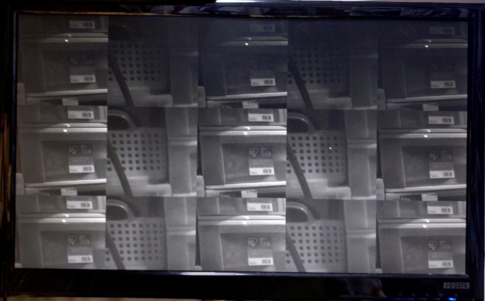

# Tang Mega 138K Pro Dock 用 IMX219 MIPI 変換基板

[English version is here (README_en.md)](README_en.md)

## 概要

[Raspberry Pi Camera V2](https://raspberry-pi.ksyic.com/main/index/pdp.id/144/pdp.open/144) のベース基板を入れ替えて、Sipeed さんの [Tang Mega 138K Pro Dock](https://wiki.sipeed.com/hardware/en/tang/tang-mega-138k/mega-138k-pro.html) に繋ぐための変換基板です。

おそらく Sipeed さんの独自仕様と思われる 24pin の MIPI コネクタで Sonyさんの IMX219 センサーを利用可能にします。

## 変換基板のイメージ

下記のような変換基板です。

Raspberry Pi Camera V2 カメラから、カメラモジュール部分を取り外して、この変換基板に取り付けることで、利用します。

実際に取り付けたのが下記の写真です。

## 各種データ

回路図は下記の通りです(pdf版は[こちら](imx219_mipi24/imx219_mipi24.pdf))です。

[KiCAD](https://www.kicad.org/) version 9.0.0 で設計しております。

[JLCPCB](https://jlcpcb.com/) さんの４層基板で「FR4-Standard TG 135-140」の製造仕様に合わせてインピーダンスコントロールしております。

手元での試作は JLCPCBさんの PCBA で行っており、たまたま在庫表示のあった部品を選定したこともあり、発信器などでディスコン品番なども混ざっておりますが、各自で製造される場合は必要に応じて後継の互換品を選定ください。

ケーブルは[05-24-A-0030-A-4-06-4-T](https://www.marutsu.co.jp/pc/i/46064636/) と [05-24-A-0152-A-4-06-4-T](https://www.marutsu.co.jp/pc/i/46064715/) の2種類で試しております。

## 動作テスト

下記のプロジェクトなどで動作テストを行っております。

- https://github.com/ryuz/jelly/tree/master/projects/tang_mega_138k_pro/tang_mega_138k_pro_imx219_720p
- https://github.com/ryuz/jelly/tree/master/projects/tang_mega_138k_pro/tang_mega_138k_pro_imx219_stereo

実際に2つのカメラを繋いで、256x256 の画像を交互に表示したいるのが下記です。

なお単純な受信テストは 2lane と 4lane の両方ともうまくいっております。

## 免責事項

本設計データは、研究開発用の試作実験に用するものであり、利用に際して発生した如何なる損害も作者は補償いたしませんので予めご了承ください。

## ライセンス(License)

本設計データは、[クリエイティブ・コモンズ 表示-非営利 4.0 国際 ライセンス](https://creativecommons.org/licenses/by-nc/4.0/deed.ja)の下で提供されています。

製造した本基板の販売や配布を行わない限りは、趣味や研究開発用途でご自由にお使いいただく事が出来ます。
また、商用に製造販売を希望される場合は、別途ライセンス契約を作者までご相談ください。

## BOOTH への出品

自身で基板製造するのが難しい方の為に、作者が少し余分に製造したものを [BOOTH](https://rtc-lab.booth.pm/) に出品しております。

- [Tang Mega 138K Pro Dock 用 IMX219 MIPI 変換基板](https://rtc-lab.booth.pm/items/7095235)
- [Tang Mega 138K Pro Dock 用 IMX219 MIPI カメラ基板(イメージセンサー付き)](https://rtc-lab.booth.pm/items/7132890)

あくまで試作品ですので品質を保証できるものではなく、在庫限りとなりますが、よろしければご活用ください。

## 作者情報

渕上 竜司(Ryuji Fuchikami)
[リアルタイムコンピューティング研究所](https://rtc-lab.com/)
